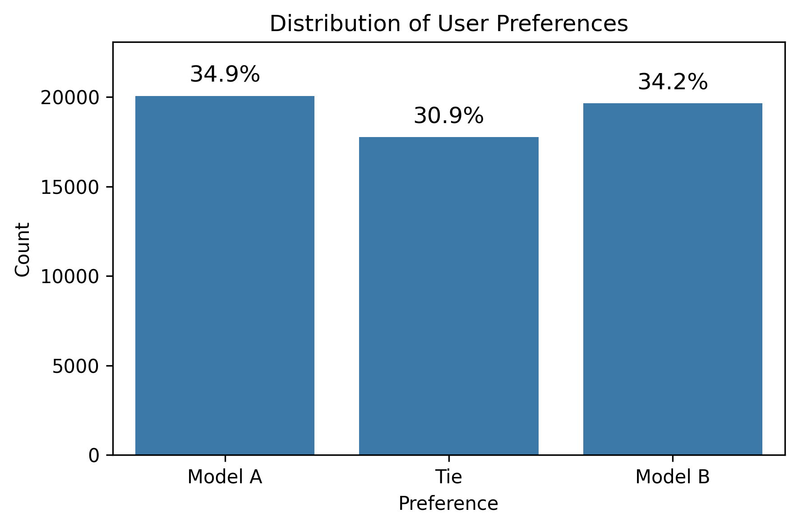
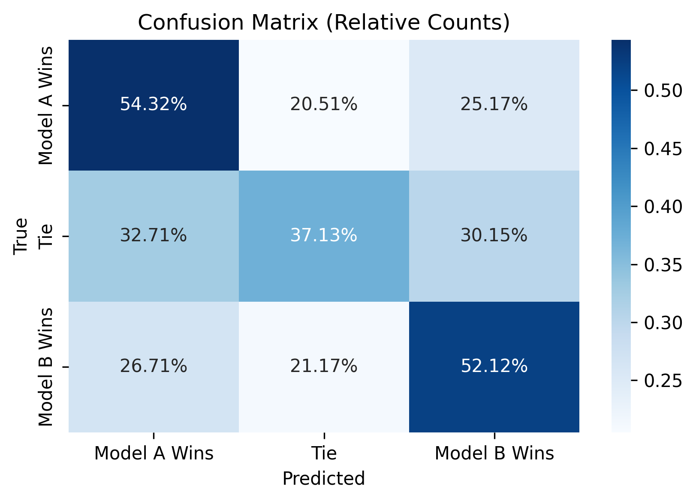

# Chatbot Arena Preferences

Welcome to my project for the 
[Chatbot Arena Human Preferences Prediction competition on Kaggle](https://www.kaggle.com/competitions/lmsys-chatbot-arena). In this competition, the challenge 
is to predict which response users 
will prefer in head-to-head battles 
between chatbots powered by large 
language models (LLMs), to 
ultimately improve how LLMs align with 
human preferences. 

## Project Overview

The goal of this project is to predict which chatbot response a user will prefer using a dataset of prompts and responses from two LLMs. I designed this pipeline to handle feature extraction, model training, and evaluation, aiming for simplicity and efficiency. The final model predicts user preferences based on a combination of basic linguistic features, readability metrics, and BLEU scores. 
This project has been implemented in 
a single Python script (`main.py`) for 
ease of automatic conversion to a 
Jupyter 
notebook (`main.ipynb`) for 
submission to the 
Kaggle competition.

## Features

- **Basic linguistic features**: 
  Extracted from both the user prompt and chatbot responses, including character counts, word counts, sentence structure, and type-token ratios.
- **BLEU scores**: Comparison of the 
  responses from both chatbots to 
  measure their similarity to each 
  other.
- **Differences, ratios, and 
  means**: Calculated between 
  various basic features of the prompt 
  and the responses.

*Note: This project is currently at 
a proof-of-concept stage, so 
next steps would include adding more 
sophisticated features to capture
aspects of style, structure, 
sentiment, and 
semantics.*

## Visualizations

Three key visualizations are included in this project:

### Bias Distribution Plot
   
This plot shows 
   how often users preferred model A 
   or model B or chose a tie. The 
   training dataset is fairly well 
   balanced but contains relatively 
   fewer ties. So far, in this 
   project, I haven't taken further 
   steps to unbias the training data.

### Feature Importance Plot 

   
   This plot highlights which features 
   had the 
   biggest impact on the winning 
   model's predictions. The most 
   important 
   feature by far is the 
   difference in response length,
   as indicated by character count. 
   The BLEU score is also important, 
   probably especially for 
   identifying ties in the case of 
   (near-)identical responses.

### Confusion Matrix
   
This plot displays how 
well the model predicted user 
   preferences by comparing the true 
   vs. predicted classes.
   The winning model still 
   struggles with 
   correctly predicting ties, though 
   it performs decently when predicting 
   model A or model B wins.

## Models used

I experimented with two types of models:
- **Logistic Regression**: A baseline model that is simple and effective.
- **XGBoost**: A gradient-boosted decision tree model that leverages more advanced techniques to improve performance.

## Evaluating model performance
This program automatically trains, 
evaluates, and compares the log loss 
of models whose name and parameters 
are manually specified in a 
dictionary passed into the main 
function.
The best model so far was an 
xgboost_rf with parameters 
{'n_estimators': 50, 
'max_depth': 4, 'random_state': 42}. 
The log loss on the validation set 
within this program
was 1.02367, which resulted in a 
public score of 1.03341 and a 
private score of 1.08748 on Kaggle's 
test set.

## Next steps
This program could still be improved 
by: 
* Extracting more sophisticated features
* Trying additional types of 
  machine learning models
* Exploring the effects of varying 
  model parameters more systematically

