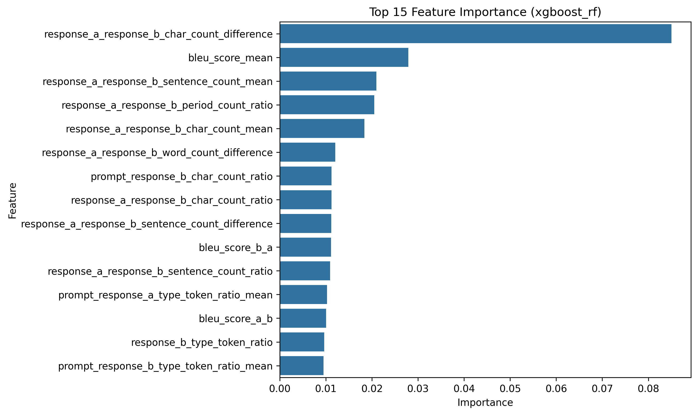

# Chatbot Arena Preferences

## Introduction
This program is designed for the
[Chatbot Arena Human Preferences 
Prediction](https://www.kaggle.com/competitions/lmsys-chatbot-arena) competition on Kaggle.
The challenge is to predict which 
chatbot responses users prefer, 
based on a dataset of 
prompts and
responses from large language 
models (LLMs) that competed in 
head-to-head battles in the Chatbot 
Arena. 
I implemented the program in a single 
Python script (`main.py`) for 
ease of automatic conversion to a 
Jupyter 
notebook (`main.ipynb`) for 
submission to the 
Kaggle competition.

## Approach
This program contains a pipeline to 
handle feature extraction, model 
training and evaluation, selection 
of the best model,
visualization of the data and model 
performance, and generation of 
predictions in the format specified 
by Kaggle.

### Features
- **Basic linguistic features**: 
  Extracted from both the user prompt and chatbot responses, including character counts, word counts, sentence structure, and type-token ratios
- **BLEU scores**: Comparison of the 
  responses from both chatbots to 
  measure their similarity to each 
  other
- **Differences, ratios, and 
  means**: Calculated between 
  various basic features of the prompt 
  and the responses

### Models used
I experimented with two types of 
machine learning models:
- **Multinomial Logistic 
  Regression** using 
  LogisticRegression from `sklearn` 
- **Gradiented-boosted decision 
  trees** using XGBoostClassifier from 
  `xgboost` 

### Evaluating model performance
This program evaluates and compares the 
log loss 
of models whose name and parameters 
are manually specified in a 
dictionary passed into the main 
function, and it selects the model 
with the best score to generate the 
final predictions for Kaggle.
The best model so far was an 
xgboost_rf with parameters 
{'n_estimators': 50, 
'max_depth': 4}. 
The log loss on the validation set 
within this program
was **1.02367**, which resulted in a 
public score of **1.03341** and a 
private score of **1.08748** on 
Kaggle's 
test set.

## Visualizations
### Bias Distribution Plot
   
This plot shows 
   how often users preferred 
   the response from model A 
   or model B or chose a tie in the 
   head-to-head matchup. The 
   training dataset is fairly well 
   balanced but contains relatively 
   fewer ties.

### Feature Importance Plot 

   
   This plot highlights which features 
   had the 
   biggest impact on the  
   model's predictions. The most 
   important 
   feature by far is the 
   difference in response length,
   as indicated by character count. 
   The BLEU score is also important, 
   probably especially for 
   identifying ties in the case of 
   (near-)identical responses.

### Confusion Matrix
   
This plot displays how 
well the model predicted user 
   preferences by comparing the true 
   vs. predicted classes.
   The model still 
   struggles with 
   correctly predicting ties, though 
   it performs decently when predicting 
   model A or model B wins.

## Next steps
This program could still be improved 
by: 
* Unbiasing the data and/or adding a 
  feature to account for the 
  left-right positioning of the response
* Extracting more sophisticated 
  features to capture aspects of 
  style, structure, sentiment, and 
  semantics
* Trying additional types of 
  machine learning models
* Exploring the effects of varying 
  model parameters more 
  systematically with a grid search
* Implementing cross-validation to better assess model generalization and prevent overfitting to the validation set
